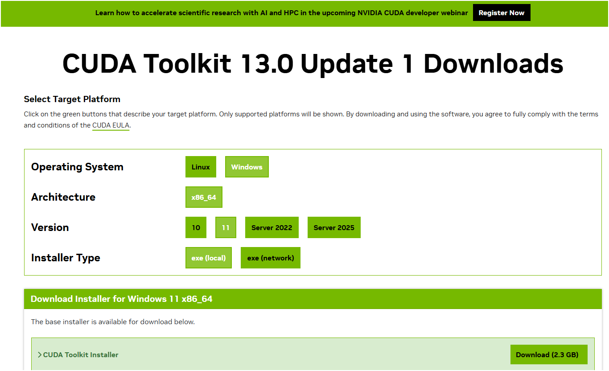
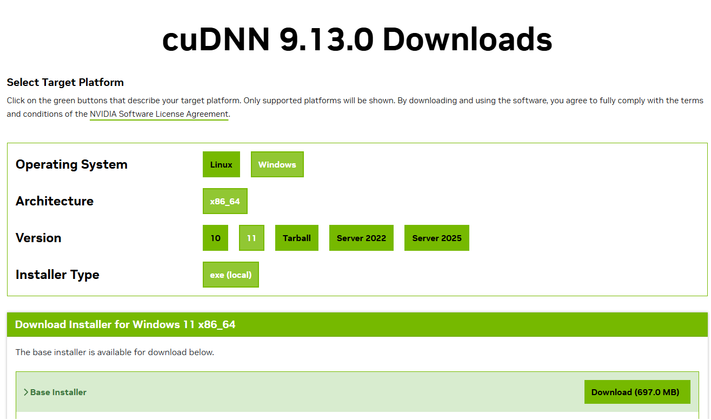

# はじめに

本手順書では Windows11 上に CUDA／cuDNN を導入するための手順について説明する。  
※最新の NVIDIA ドライバーのダウンロードしておくこと

| 名称  | 役割                                                                                                                             |
| ----- | -------------------------------------------------------------------------------------------------------------------------------- |
| CUDA  | NVIDIA の GPU を使って汎用計算（GPGPU）を可能にする開発基盤。GPU を使うための「基盤」                                            |
| cuDNN | CUDA 上で動作するディープラーニング向けライブラリ。畳み込み・プーリング・RNN などを GPU 最適化。深層学習用に最適化された「部品」 |

### 参考にしたサイト

- https://qiita.com/ryome/items/9b838fa726ec55e47b9c

# CUDA Toolkit の導入

## ■ CUDA Toolkit インストーラのダウンロード

[CUDA Toolkit ダウンロード用ページ](https://developer.nvidia.com/cuda-downloads)に移動する。  
環境について下記を選択し、ダウンロードする。

- Operating System：Windows
- Architecture：x86_64
- Version：11
- Installer Type：exe（local）



## ■ CUDA Toolkit インストーラの実行

前の手順でダウンロードしたインストーラ（cuda_XX.X.X_windows.exe）を実行する。  
実行後、下記案内に沿って進める。

- １．使用許諾契約書：同意して続行する
- ２．オプション：高速（推奨）※CUDA Visual Studio Integration 部分はチェックを入れる
- ３．インストールが開始する

インストール完了後、下記環境変数が自動的に設定される。

- CUDA_PATH：C:\Program Files\NVIDIA GPU Computing Toolkit\CUDA\v13.0
- CUDA_PATH_V13_0：C:\Program Files\NVIDIA GPU Computing Toolkit\CUDA\v13.0

※システム環境変数を編集する際は、管理者権限で PowerShell を起動し下記コマンドを実行する

```powershell
rundll32.exe sysdm.cpl,EditEnvironmentVariables
```

## ■ cuDNN インストーラのダウンロード

[cuDNN ダウンロード用ページ](https://developer.nvidia.com/cudnn-downloads)に移動する。  
環境について下記を選択し、ダウンロードする。

- Operating System：Windows
- Architecture：x86_64
- Version：11
- Installer Type：exe（local）



## ■ cuDNN インストーラの実行

前の手順でダウンロードしたインストーラ（cudnn_X.XX.X_windows.exe）を実行する。  
実行後、下記案内に沿って進める。

- １．使用許諾契約書：同意して続行する
- ２．オプション：高速（推奨）
- ３．インストールが開始する

## ■ インストールできているかの確認

下記コマンドが実行できれば OK

```
$ nvcc --version
nvcc: NVIDIA (R) Cuda compiler driver
Copyright (c) 2005-2025 NVIDIA Corporation
Built on Wed_Aug_20_13:58:20_Pacific_Daylight_Time_2025
Cuda compilation tools, release 13.0, V13.0.88
Build cuda_13.0.r13.0/compiler.36424714_0
```
