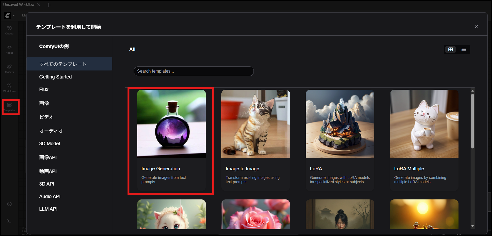
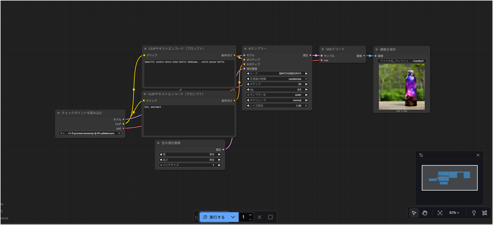

# はじめに

本手順書では Windows11 上に ComfyUI を導入する手順について説明する。

## ■ 前提

下記が導入済みであること

- CUDA／cuDNN が導入済み（https://github.com/is0383kk/Settings-Memo/blob/main/cuda/install_cuda_cudnn_win11.md）
- uv が導入済み（https://github.com/is0383kk/Settings-Memo/blob/main/python/uv/install_uv_win11.md）

## ■ 動作確認済み環境

- プロセッサ：13th Gen Intel(R) Core(TM) i7-13700F (2.10 GHz)
- 実装 RAM：32.0 GB (31.9 GB 使用可能)
- システムの種類：64 ビット オペレーティング システム、x64 ベース プロセッサ
- GPU：NVIDIA GeForce RTX 4070
- CUDA（12.9）／cuDNN 導入済み
- Python 3.11.9

# １．ComfyUI の導入

## ■ ComfyUI をクローンする

下記コマンドで ComfyUI をクローンする

```powershell
git clone https://github.com/comfyanonymous/ComfyUI
```

## ■ ComfyUI 用の Python 仮想環境を作成する

下記コマンドで仮想環境（uv）を作成する

```powershell
$ uv venv .venv
Using CPython 3.11.9 interpreter at: C:\Users\ユーザ名\.pyenv\pyenv-win\versions\3.11.9\python.exe
Creating virtual environment at: .venv
Activate with: .venv\Scripts\activate
```

## ■ 仮想環境を有効化する

下記コマンドで仮想環境に入る

```powershell
.venv\Scripts\activate
```

## ■ 必要な Python ライブラリをインストールする

下記コマンドで**CUDA に対応した PyTorch（torch／torchvision／torchaudio）をインストール**する  
※requirements.txt から導入すると cpu 版がインストールされるため  
※CUDA のバージョン合わせて末尾の「XXX」は変更する（12.9 の場合は 129）

```powershell
uv pip install torch torchvision torchaudio --index-url https://download.pytorch.org/whl/cuXXX
```

その後、GPU (CUDA 12.9 の例) が PyTorch から利用できる状態になっていることを確認する

```powershell
$ python -c "import torch; print(torch.cuda.is_available(), torch.version.cuda)"
True 12.9
```

下記コマンドで残りのライブラリをインストールする

```powershell
uv pip install -r requirements.txt
```

## ■ ComfyUI の動作確認をする：サーバ起動

下記コマンドでローカル上に ComfyUI サーバを立ち上げる

```powershell
$ python main.py

Checkpoint files will always be loaded safely.
Total VRAM 12282 MB, total RAM 32616 MB
pytorch version: 2.8.0+cu129
Set vram state to: NORMAL_VRAM
Device: cuda:0 NVIDIA GeForce RTX 4070 : cudaMallocAsync
Using pytorch attention
Python version: 3.11.9 (tags/v3.11.9:de54cf5, Apr  2 2024, 10:12:12) [MSC v.1938 64 bit (AMD64)]
ComfyUI version: 0.3.61
****** User settings have been changed to be stored on the server instead of browser storage. ******
****** For multi-user setups add the --multi-user CLI argument to enable multiple user profiles. ******
ComfyUI frontend version: 1.26.13
[Prompt Server] web root: C:\ComfyUI\.venv\Lib\site-packages\comfyui_frontend_package\static

Import times for custom nodes:
   0.0 seconds: C:\ComfyUI\custom_nodes\websocket_image_save.py

Context impl SQLiteImpl.
Will assume non-transactional DDL.
No target revision found.
Starting server

To see the GUI go to: http://127.0.0.1:8188
```

## ■ ComfyUI の動作確認をする：ComfyUI にアクセスしてみる

ログの最後にサーバへのリンクが出力されるのでアクセスする。

- http://127.0.0.1:8188

アクセスすると「v1-5-pruned-emaonly-fp16.safetensors」をダウンロードするように指示が出るのでダウンロードする  
その後、下記構造になるように配置する

- ./models/checkpoints/v1-5-pruned-emaonly-fp16.safetensors

## ■ ComfyUI の動作確認をする：ComfyUI を試す

再度 ComfyUI を起動する

```powershell
$ python main.py
```

下記画面に遷移する

- 「template」→「Image Generation」



ワークフロー画面が表示されるため「実行する」ボタンをクリックする



正常に実行できれば下記フォルダに生成された画像が格納される

- `output\ComfyUI_00001_.png`

# ２．ComfyUI-Manager の導入

ComfyUI-Manager を導入することでカスタムノードの導入ができるようになる
今後、カスタムノードを使用する場合もあるので導入しておく

## ■ ComfyUI-Manager をクローンする

`custom_nodes`ディレクトリ配下で ComfyUI-Manager をクローンする

```powershell
cd .\custom_nodes\
git clone https://github.com/ltdrdata/ComfyUI-Manager.git
```

その後、ComfyUI-Manager に必要なライブラリをインストールする

```
cd .\ComfyUI-Manager\
uv pip install -r requirements.txt
```
